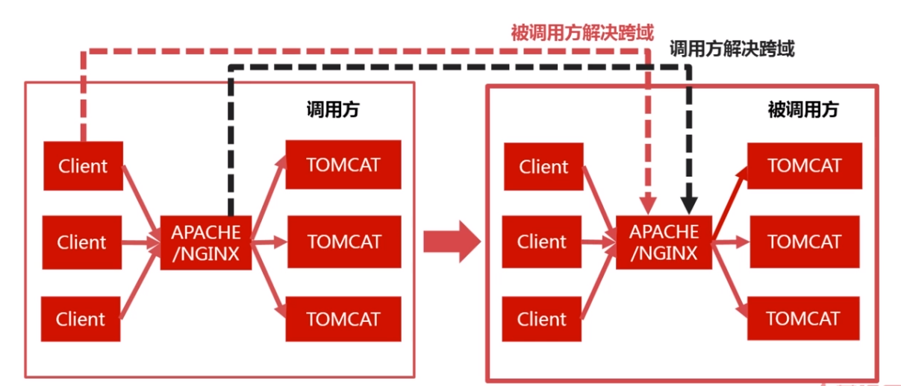
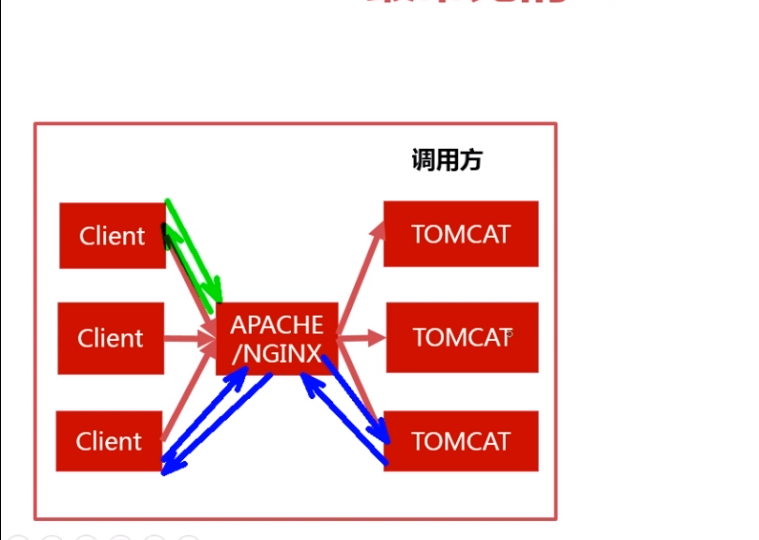

### 跨域
> **浏览器**限制 
> 跨域
> XHR（XMLHttpquest）请求 
同时满足才会产生浏览器安全问题
不是 XHR请求，就算是跨域也不会报错 network - Type

- 后台日志没有报错
- 返回值 200 Response
### 解决思路
- 浏览器限制
	- 指定参数，客户端改动较大。
- XHR  不是这个类型就行改用：
	- JSONP 无法满足现在的开发要求
- 跨域 
	- 被调用方：A调用B，让B加字段让支持该域名，不适用不是自己公司的
	- 调用方：隐藏跨域 代理转到B域名下，让B看起来没有跨域

### JSONP （json pedding）
> 非官方协议，是一个约定请求的参数中如果包含指定的参数callback，JSONP请求，服务器发现是JSONP请求，边将原来的JSON对象改为JS代码，JS形式是函数调用的形式，函数名是callback函数的值，参数是原来要返回的JSON对象
```
$.ajax({
	dataType:JSONP
})
// Type  script 浏览器不会校验
```
> 动态创建script
> 服务器后台是需要改动的，需要返回 JSON格式
> callback 前后台约定 返回JSONP 对象改为JS代码
 jq断点可以看到-随即销毁
请求参数除了`callback`还有一个`_`说明结果可以被缓存：`cache:true`
### JSONP弊端
- 服务器需要改动，不是自己的代码，无能为力
- 只支持get方法, 因为原理是动态创建`script`
- 发送的不是XHR请求 不如：异步各种事件都没有
### 
- 跟用户数据有关的就是动态请求 TOMCAT
- 图片、css、js http服务器




 http服务器处理静态请求，负载均衡

### 被调用方解决跨域
被调用方响应头中字段，允许被调用
### 调用方
隐藏跨域  通过HTTP转发
反向代理
> 简单请求 先通过后验证
> 非简单请求 预检命令 OPTIONS 通过之后才把请求真正的发送出去 共两条请求 缓存解决

带Cookie跨域,被调用方 * 不满足
