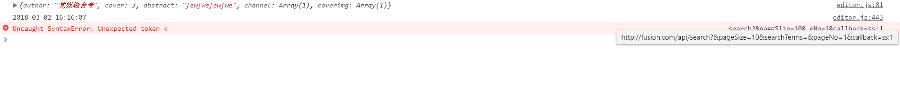
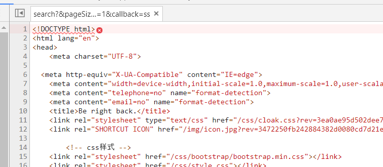

### Uncaught SyntaxError: Unexpected token <
#### bug描述：

#### 点进去

~%?…,# *'☆&℃$︿★?

百度这个报错信息可以看到这个博客 http://www.tpyyes.com/a/js_css/2017/0928/250.html 结果没能解决。

问导师解决后整理了一下他们的思路：
> 导师：提示的是表达式错误，肯定是格式有问题，格式有问题就得看返回的数据是什么，一看是个html页面，当然要打开看看了

> 前端同事：不知道为什么会出现这个问题，肯定是要先找找造成这个问题的地方，先找一下儿在哪里发了这个请求吧