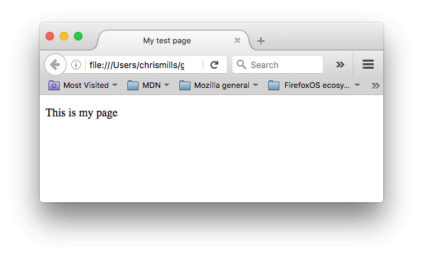

<a href="https://developer.mozilla.org/zh-CN/docs/Learn/HTML/Introduction_to_HTML/Getting_started">查看原文</a>
## 什么是 HTML?
#### HTML 用于告诉您的浏览器如何构造您访问的网页。例如：
```
My cat is very grumpy
```
> 如果我们想要自己的行，我们可以指定它是一个段落通过将它包含在段落标签```<p>``` 元素：
```
<p>My cat is very grumpy</p>
```
#### 剖析这个 HTML 元素

> 我们的元素的主要部分是：
+ 开始标签：包括元素的名称（在本例中，p），包裹在开始和结束尖括号中。这表示元素开始或开始生效 - 在这种情况下，表示了一个段落的开头。
+ 结束标签：这与开始标记相同，除了它在元素名称之前包含正斜杠。这表示元素结束的位置 - 在这种情况下，表示了一个段落的结尾. 没有包含结束标记是一个常见的初学者错误，并可能导致奇怪的结果。
+ 内容：这是元素的内容，在这种情况下只是文本。
+ 元素：开始标记，加结束标记，加内容，等于元素。
#### 嵌套元素
> 你也可以把元素放到其它元素之中——这被称作嵌套。如果我们想要表明我们的小猫脾气很暴躁，可以将very嵌套在```<strong>``` 中，意味着这个单词被着重强调:

```
<p>My cat is <strong>very</strong> grumpy.</p>
```

> 你需要确保元素被正确的嵌套：在上面的例子中我们先打开```<p>```元素，然后才打开```<strong>```元素，因此必须先将```<strong>```元素关闭，然后再去关闭```<p>```元素。下面的例子是错误的：
```
<p>My cat is <strong>very grumpy.</p></strong>
```
> 所有的元素都需要正确的打开和关闭，这样才能按你所想的方式展现。如果像上述的例子一样进行了错误的嵌套，那么浏览器会去猜测你想要表达的意思，但很有可能会得出错误的结果。
#### 属性
> 元素也可以拥有属性，如下：

```
<p> class="editor-note">My cat is very grumpy</p>
```
> 属性包含元素的额外信息，这些信息不会出现在实际的内容中。在上述例子中，这个class属性给元素赋了一个识别的名字（id），这个名字此后可以被用来识别此元素的样式信息和其他信息。

> 一个属性必须包含如下内容：

+ 在元素和属性之间有个空格space (如果有一个或多个已存在的属性，就与前一个属性之间有一个空格.)
+ 属性后面紧跟着一个“=”符号.
+ 有一个属性值,由一对引号“ ”引起来.
#### 分析HTML文档
> 学习了一些HTML元素的基础知识，这些元素单独一个是没有意义的。现在我们来学习这些特定元素是怎么被结合起来，从而形成一个完整的HTML页面的：
```
<!DOCTYPE html>
<html>
  <head>
    <meta charset="utf-8">
    <title>My test page</title>
  </head>
  <body>
    <p>This is my page</p>
  </body>
</html>
```
#### 页面显示效果:

#### 分析如下:
- 你只需要知道```<!DOCTYPE html>```是最短的有效的文档声明。
- ```<html></html>```：元素。这个元素包裹了整个完整的页面，是一个根元素。
- ```<head></head>```元素. 这个元素是一个容器，它包含了所有你想包含在HTML页面中但不想在HTML页面中显示的内容。这些内容包括你想在搜索结果中出现的关键字和页面描述，CSS样式，字符集声明等等。以后的章节能学到更多关于<head>元素的内容。
- ```<meta charset="utf-8">```: 这个元素设置文档使用utf-8字符集编码，utf-8字符集包含了人类大部分的文字。基本上他能识别你放上去的所有文本内容。毫无疑问要使用它，并且它能在以后避免很多其他问题。
- ```<title></title>```: 设置页面标题，出现在浏览器标签上，当你标记/收藏页面时它可用来描述页面。
- ```<body></body>```:元素。 包含了你访问页面时所有显示在页面上的内容，文本，图片，音频，游戏等等。