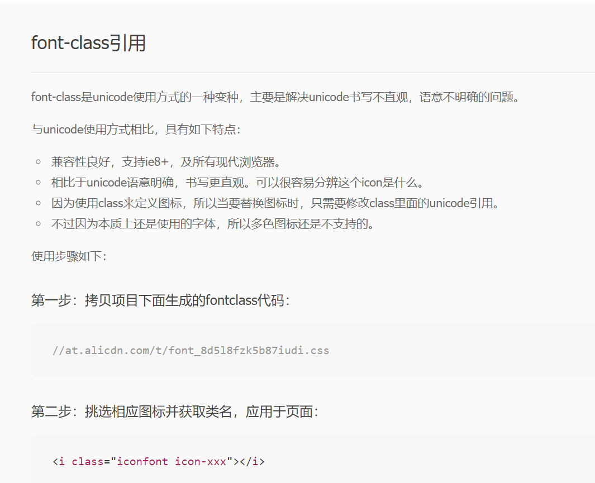
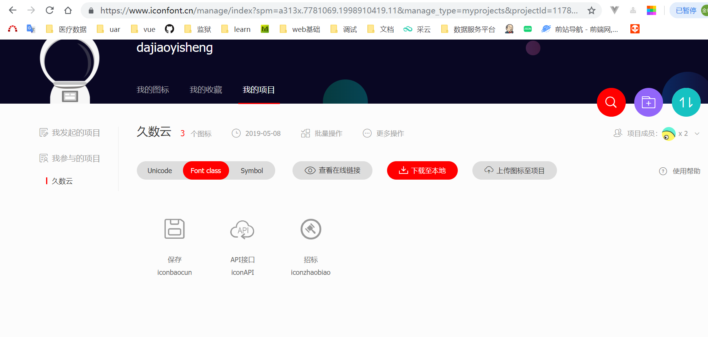
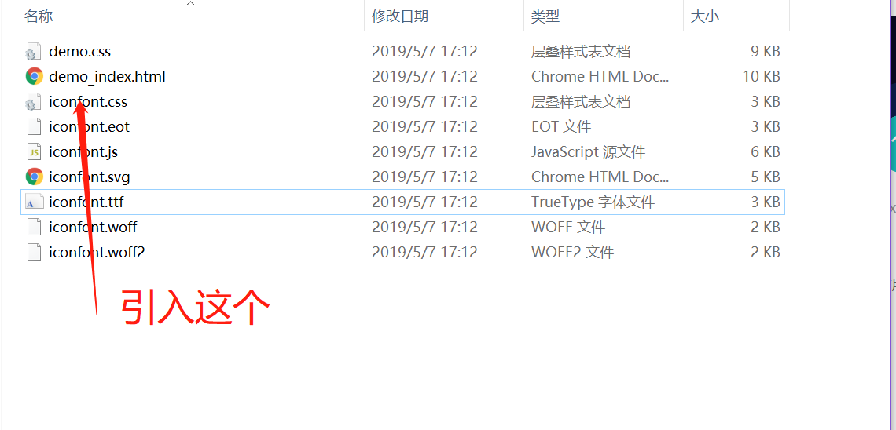
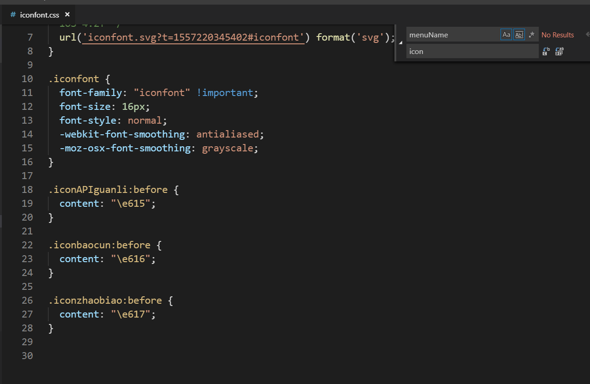

## font-class应用官方文档

<br>
<a href="https://www.iconfont.cn/help/detail?helptype=code">查看原文</a>
## 下载文件
### UED在<a href="https://www.iconfont.cn/manage/index">查看原文</a>添加的
#### 下载到本地

#### 所有文件

### 使用方法一
> 下载到本地
#### 引用

```main.js
import '@/css/iconfont/iconfont.css'
```
#### iconfont.css

#### 使用
```html
<i :class="iconfont iconAPIguanli"></i>
```
  ### 使用方法二
  > 使用在线链接(解决更新iconfont后,下载替换文件麻烦的问题,先注释,如果在线方式在网速差的时候影响加载的话再改过来,总的来说,在iconfont数量没确定下来用在线方式是很好的)
  #### 复制在线链接
  #### 使用
  ```index.html
  <link rel="stylesheet" type="text/css" href="//at.alicdn.com/t/xxx.css">
  ```
