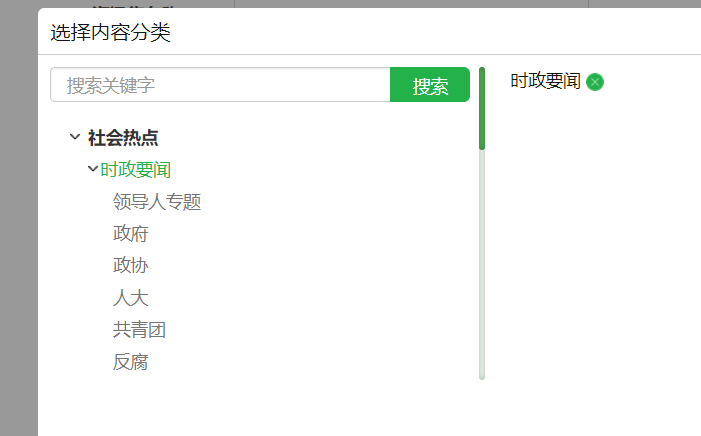

### 最基本的
- CSS顶部, JS底部
- YUI compressor/Gzip
- CDN 有
- 必要的CSS Sprite(目前因降低后期维护成本，sprite的规模有所降低)
- Ajax可缓存
### CSS渲染、页面重绘以及回流
- 适当定高：例如如果```div```内容可能有高度差异的动态内容载入。什么意思？例如数据是页面渲染完毕之后动态载入的。如果```div```不定高，就会出现个人信息载入后，整个页面下沉几像素导致页面重绘的问题。
记住这么个原则， 页面刷新载入的时候，应避免页面元素的晃动、位移等，这些都是额外的重绘。
- 图片设定不响应重绘的尺寸，如果你的``````不设定尺寸、同时外部容器没有定死高宽，则图片在首次载入时候，占据空间会从0到完全出现，左右上下都可能位移，发生大规模的重绘。
- 不使用iframe，据说开销最大的DOM元素。
### 降低静态资源请求数
- base64 url技术
- CSS图形生成，如三角
### 资源的复用
- 高宽自适应 – 无论选项卡、按钮等还是各个大小模块都是高宽自适应的，以适用于各种环境、需求
### js/HTML交互相关
- localStorage本地存储与优化。
    - 一是：大数据量交互，数据不怎么更新的，含版本控制机制，一次请求，之后高枕无忧；
    
- 二是代替cookie实现某些功能，带过期时间管理，降低页面cookie大小
- 图片懒加载
- 无关紧要资源避开加载渲染高峰显示，例如外站iframe等载入完毕后1秒再DOM创建载入处理。（我目前还没实践）
- 事件委托，避免过多的DOM元素的事件绑定
### 浏览器自身的潜力- HTML标签语义化
- ol列表的数字、table的自适应性
- ```<strong><h1-6>```粗体效果
- form相关特性，元素自身特性实现submit以及reset等效果
- HTML5 placeholder以及其他N多现代浏览器支持特性等
